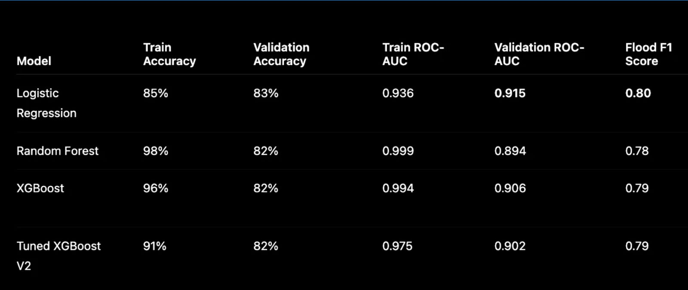

# Flood Detection using Satellite Embeddings

A completed multi-semester ILGC research project focused on flood detection using satellite imagery, AlphaEarth embeddings, and machine learning.

The project explores embedding-based geospatial flood classification as a scalable alternative to traditional threshold-based flood detection methods.

---

# Overview

Traditional flood detection methods commonly rely on manually designed thresholds using spectral indices such as NDWI or radar backscatter values. Although computationally efficient, these approaches often fail to generalize across different geographical and environmental conditions.

In this project, we explored a modern embedding-based flood detection pipeline using:

- AlphaEarth satellite embeddings
- Google Earth Engine
- Machine learning models
- Geospatial flood datasets

Instead of relying on raw pixel values or handcrafted thresholds, each geographic location is represented using a learned 64-dimensional embedding vector extracted from satellite observations.

---

# Key Contributions

- Built a complete embedding-based flood detection pipeline
- Processed GeoTIFF flood datasets from Bangladesh
- Generated AlphaEarth embeddings using Google Earth Engine
- Constructed a balanced geospatial dataset containing 600,000 labeled samples
- Trained and evaluated multiple machine learning models
- Prevented spatial leakage using file-based train-validation splitting
- Studied cross-region generalization and domain shift challenges

---

# Dataset

This project primarily uses the Bangladesh region from the FloodPlanet dataset.

Dataset characteristics:

- 15 GeoTIFF flood files
- ~15.7 million original raster pixels
- Balanced sampling strategy
- Final processed dataset:
  - 477,650 unique samples
  - 64-dimensional embedding features
  - Binary flood labels

---

# Methodology Pipeline

## 1. GeoTIFF Processing

- Flood and non-flood pixels extracted
- Raster grids converted to:
  - latitude
  - longitude
  - flood labels

## 2. Balanced Sampling

To reduce class imbalance:

- 20,000 flood samples per file
- 20,000 non-flood samples per file

## 3. AlphaEarth Embedding Generation

Embeddings extracted using:

GOOGLE/SATELLITE_EMBEDDING/V1/ANNUAL

through Google Earth Engine.

Each location is represented using a 64-dimensional embedding vector.

## 4. Machine Learning

Evaluated models:

- Logistic Regression
- Random Forest
- XGBoost
- Tuned XGBoost

---

# Visualizations

## Overall Methodology Pipeline


---

## Traditional vs Embedding-Based Approach


---

## Model Comparison



---

## Sample Prediction


---

# Results

| Model | Validation Accuracy | ROC-AUC |
|---|---|---|
| Logistic Regression | ~83% | ~0.91 |
| Random Forest | ~82% | ~0.89 |
| XGBoost | ~82% | ~0.90 |

Logistic Regression achieved the most stable and generalized performance with minimal overfitting.

---

# Key Findings

- Embedding-based representations outperform traditional threshold dependency
- AlphaEarth embeddings capture meaningful spatial and semantic information
- Simple models generalized better than highly complex ensemble models
- Cross-region generalization remains a major challenge in remote sensing ML

---

# Cross-Region Testing

Additional testing was performed on:

- Rajasthan
- Meghalaya
- Cambodia

The experiments highlighted:
- domain shift challenges
- overfitting issues
- reduced flood recall on unseen geographical regions

---

# Technologies Used

- Python
- Machine Learning
- Google Earth Engine
- AlphaEarth Embeddings
- Remote Sensing
- GeoTIFF Processing
- XGBoost
- Scikit-learn
- Jupyter Notebook

---

# Repository Structure

```bash
flood-detection-embeddings/
│
├── docs/          # Reports, presentations, research paper
├── data/          # Processed/sample datasets
├── notebooks/     # Experiment notebooks
├── src/           # Source code
├── results/       # Outputs, plots, evaluation
├── models/        # Saved trained models
└── assets/        # Images, pipeline diagrams
```

---

# Future Scope

This project can be extended further by:

- Expanding to additional countries and flood regions
- Improving cross-region generalization
- Incorporating temporal satellite observations
- Using multimodal optical + SAR data
- Exploring advanced deep learning architectures

The current implementation focuses primarily on Bangladesh flood-region analysis while providing a scalable foundation for future geospatial flood detection research.

---

# Team Members

- Mukund Jha
- Aditya Masutey
- Manish Bisht
- Sanskar Sengar

Mentor:
Dr. Shashank Tamaskar

---

# Project Status

Completed ILGC Research Project 

Current repository version is structured for:
- reproducibility
- future extension
- research continuation
- handover to future contributors/researchers

---

# License

MIT License